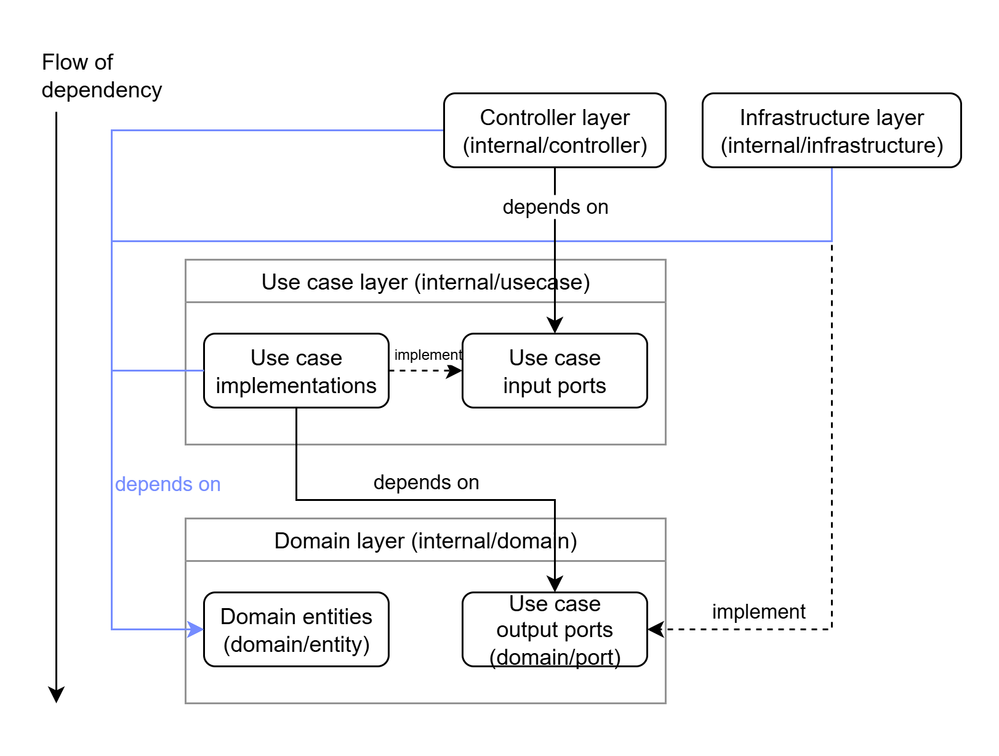
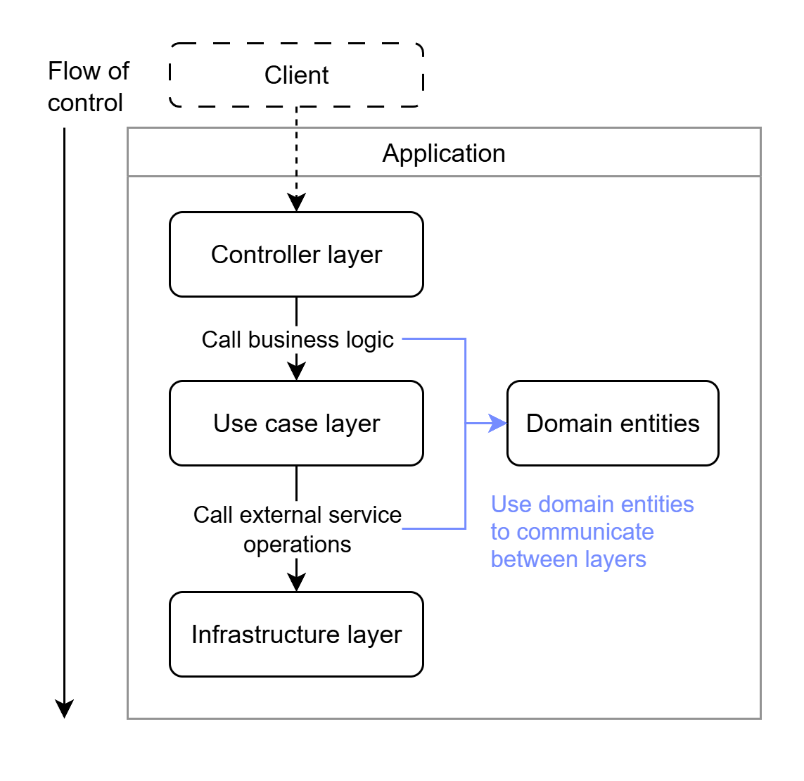

<div align="center">
  <div style="display: flex; align-items: center; justify-content: center; gap: 16px; flex-wrap: nowrap;">
    </img>
    <h1 style="text-align: left;">Go Echo Huma REST API Template by JuniorMeowMeow</h1>
  </div>
</div>

A RESTful API server template built with Go using Echo and Huma frameworks.
Designed with my simplified interpretation of Clean Architecture and Hexagonal Architecture principles.

> [!WARNING]
> This project and the documentation are still under development.  
> The project structure and examples may change over time.

## Contents
- [Current Features](#Current-Features)
- [Project Principles](#Project-Principles)
- [Architecture Overview](#Architecture-Overview)
- [Project Layout](#Project-Layout)
- [TODO](#TODO)
- [Credits](#Credits)

## Current Features

- Easy-to-maintain RESTful API server
- JWT-based authentication and authorization
- Automatic OpenAPI specification generation from source code
- Configuration using environment variables
- Live reload for the development environment
- Mocking frameworks and Testcontainers for unit and integration testing
- Integration with PostgreSQL, MongoDB, S3-compatible object storage, and external HTTP APIs
- CI/CD pipelines for for automated checks and Docker image publishing

## Project Principles

The project structure is inspired by Clean Architecture and Hexagonal Architecture (Ports and Adapters) with the following principles:
- The Dependency Rule: source code dependencies can only point inward
- Dependency Inversion Principle: use interfaces to make dependencies oppose the flow of control

These principles help achieve separation of concerns, which leads to:
- Independence of frameworks
- High maintainability
- Highly testable code

However, this implementation is simplified to better fit Go’s implicit interfaces.

## Architecture Overview

### Flow of Dependency

</img>

### Flow of Control

</img>

## Project Layout

```bash
.
├── .github/                # GitHub-related files
│   └── workflows/          # GitHub Actions workflows for CI/CD
│
├── assets/                 # Assets used in README.md
│
├── cmd/                    # Application entrypoints
│   ├── gen-docs/           # OpenAPI specifications generation command
│   └── server/             # Main API server entrypoint
│
├── config/                 # Configuration files (.env)
│
├── db/                     # Relational database resources
│   ├── migrations/         # SQL migration files
│   └── queries/            # SQL query files used by sqlc
│
├── docs/                   # Generated OpenAPI specifications
│
├── internal/               # Internal application source code
│   ├── app/                # Dependency initialization and application setup
│   ├── config/             # Configuration loader and definitions
│   │
│   ├── controller/         # Controller Layer
│   │   └── restapi/        # REST API implementation
│   │       ├── api/        # Router setup, route registration and OpenAPI integration
│   │       ├── handler/    # HTTP handlers
│   │       ├── middleware/ # HTTP middlewares
│   │       └── schema/     # Request and response schemas
│   │
│   ├── domain/             # Domain layer
│   │   ├── entity/         # Domain entities/models
│   │   └── port/           # Use case output ports/interfaces
│   │
│   ├── infrastructure/     # Infrastructure layer (implements use case output ports)
│   │   ├── external/       # External service integrations
│   │   │   └── petstore/   # Petstore client implementation
│   │   │
│   │   ├── repository/     # Database repository implementations
│   │   │   ├── mongodb/    # MongoDB repository implementations
│   │   │   └── postgres/   # PostgreSQL repository implementations
│   │   │
│   │   └── storage/        # File/object storage implementations
│   │       └── s3api/      # S3-compatible storage implementation
│   │
│   ├── usecase/            # Use case layer (business logic and use case input ports)
│   │
│   └── utility/            # Shared utilities and helper functions
│
├── scripts/                # Makefile commands and helper scripts
│
├── test/                   # Test utilities and integration tests
│   ├── helper/             # Testing helper utilities
│   └── integration/        # Integration test suites
│
├── Dockerfile              # Application Docker image definition
├── Makefile                # Project commands
├── compose.yaml            # Main Docker Compose configuration
├── compose.dev.yaml        # Development environment Docker Compose configuration
└── sqlc.yaml               # sqlc configuration
```

### Example Makefile Commands

```bash
make run              # Run the API server locally
make gen-docs         # Generate OpenAPI specifications
make mock-gen         # Generate mocks using mockery

make test             # Run all tests
make pre-commit       # Run checks, tests, and generate OpenAPI specifications

make dev-build        # Build Docker images for the development environment
make dev-up           # Start development containers using Docker Compose
make dev-down         # Stop development containers

make sqlc-gen         # Generate Go code from SQL queries
make migrate-status   # Show database migration status
make migrate-up       # Apply all pending migrations
make migrate-down     # Roll back the latest migration
make migrate-create name=migration_name
# Create a new migration file
```

## TODO

- WebSocket Controller
- RabbitMQ Controller

## Credits

### Web Frameworks

- [Echo](https://github.com/labstack/echo)
- [Huma](https://github.com/danielgtaylor/huma)

### Configuration & Development Tools

- [caarlos0/env](https://github.com/caarlos0/env)
- [Air](https://github.com/air-verse/air)

### Testing Tools

- [Testify](https://github.com/stretchr/testify)
- [Mockery](https://github.com/vektra/mockery)
- [Testcontainers for Go](https://github.com/testcontainers/testcontainers-go)

### Infrastructure

- [pgx](https://github.com/jackc/pgx)
- [sqlc](https://github.com/sqlc-dev/sqlc)
- [goose](https://github.com/pressly/goose)
- [MongoDB Go Driver](https://github.com/mongodb/mongo-go-driver)
- [AWS SDK for Go v2](https://github.com/aws/aws-sdk-go-v2)
- [oapi-codegen](https://github.com/oapi-codegen/oapi-codegen)
